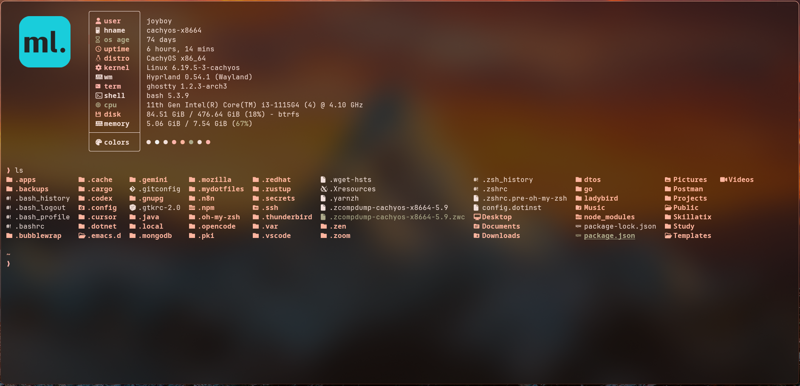

# MyGhostty – Ghostty Installer & Configuration


A simple and interactive installer for Ghostty that automatically installs Ghostty, applies a customized configuration, themes, and shell integration across major Linux distributions.

The installer provides a quick and convenient way to set up a clean Ghostty environment without manual configuration.



## Installation and Documentation

### Quick Installation

You can install the Ghostty configuration and theme with the following command:

```sh
bash <(curl -s https://raw.githubusercontent.com/devSagarSardar/MyGhostty/main/install.sh) 
```
The installer will guide you through the setup process and allow you to choose:

- Install Ghostty (if not installed)
- Install configuration
- Install theme
- Enable shell integration
- Set Ghostty as default terminal

### Supported distributions include:

- Arch Linux

- Fedora

- openSUSE

- Debian / Ubuntu based distributions

For other distributions, you can manually install Ghostty and then run the installer to apply the configuration and theme.

See the official Ghostty installation guide: https://ghostty.org/docs/install/binary

And to apply the configurations replace default config file with MyGhostty/config and paste theme folder into that directory.

## Features

- Automated interactive Ghostty installation

- Custom Ghostty configuration

- Matugen theme support

- Automatic shell detection (bash / zsh / fish)

- Optional default terminal setup

## Acknowledgements

Thanks to the developers of the following projects that inspired this setup:

- https://github.com/ghostty-org/ghostty

- https://github.com/mylinuxforwork

## Contributions

Contributions, suggestions, and improvements are welcome.

Feel free to open issues or submit pull requests.
